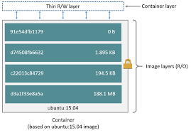

# Containers

Container is a standard unit of software that functions like a fully provisioned machine that has all the necessary software installed on it to run an appication. It basically is a way of packaging software so that application and their dependencies have a self-contained environment to run in, and is insulated from the host OS and other applications. They can be easily ported to other environments.

Images define what goes into a container. Containers are running instances of Images(i.e containers are built from Images).

# Benefits of Containers
* Once image is defined, it's easy to create and deploy
* Quick/Easy rollbacks due to image immutability
* Runs the same on all Infrastructure(Cloud, Server etc) since the environment is self-contained
* Portable acorrs any OS or Cloud that supports containers

# Image
* Read-only template used to create a container
* Container images are like a snapshot of a container
* Images can be stored in a "registry" - like repository for images
* Images are immutable i.e once they are created, it should not be changed. If there is a change needed, then a new image should be created.
* Container images are built up from layers

# Image layer

* Docker image s built up from a series of layers
* Each layer is build using an instruction(modification) in te Dockerfile.
* Layers are "stacked" on top of ones before
* Each layer is only the set of differences from the last one.
* Think of base layer as being an OS image
* Each layer is R/O except for last one.
* Last/Top layer is "Container layer"
* Container layer is thin R/W layer
* All changes made to running container go in that layer

